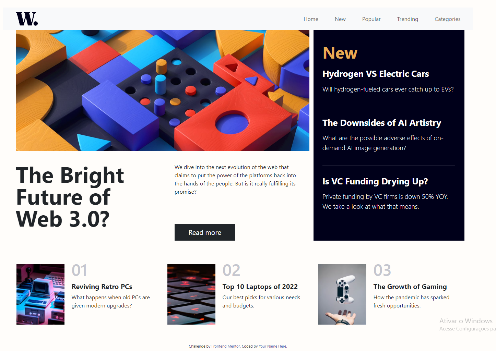

## Table of contents

- [Overview](#overview)
    - [The challenge](#the-challenge)
    - [Screenshot](#screenshot)
    - [Links](#links)
- [My process](#my-process)
    - [Built with](#built-with)
    - [What I learned](#what-i-learned)
    - [Continued development](#continued-development)
    - [Useful resources](#useful-resources)
- [Author](#author)
- [Acknowledgments](#acknowledgments)

## Overview

Welcome to my News Homepage project, which is part of the Frontend Mentor challenge. This project was created to showcase my skills in frontend development using Bootstrap, HTML, and CSS.

### The challenge

Users should be able to:

- View the optimal layout for the interface depending on their device's screen size
- See hover and focus states for all interactive elements on the page

### Screenshot

### Links

- Solution URL: [https://leopk05.github.io/new-homepage/](https://leopk05.github.io/new-homepage/)

## My process

This project was my first experience using Bootstrap to create a responsive design, which presented some challenges along the way. One of the biggest difficulties I encountered was positioning buttons on the screen in a way that was visually appealing and functional. It took some trial and error, but I eventually found a layout that worked well and allowed users to easily navigate the page.

Overall, the process of building this project was a valuable learning experience. I gained a deeper understanding of frontend development and improved my skills in using HTML and CSS to create visually appealing and functional web pages.

### Built with

- Semantic HTML5 markup
- CSS custom properties
- Flexbox
- CSS Grid
- Mobile-first workflow
- Bootstrap5

### What I learned

During the development of this project, I learned several important skills and concepts, including:

- How to use Bootstrap to create responsive web designs
- How to structure HTML and CSS files for better organization and maintainability
- How to implement common frontend features such as menus, buttons, and responsive images

I also gained valuable experience in using Git for version control and collaborating with other developers.

### Continued development

While I am proud of what I have accomplished with this project, I understand that there is always room for improvement. In the future, I plan to continue developing my frontend skills by learning more advanced CSS techniques and exploring other frontend frameworks like React and Vue.
